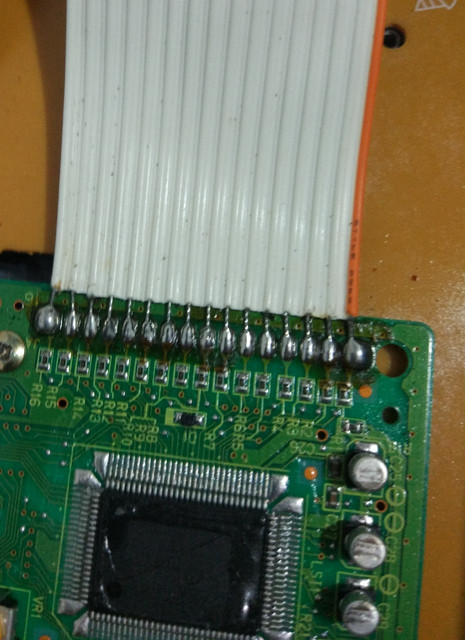
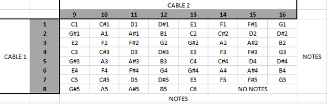
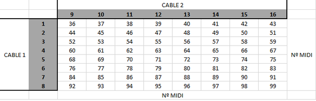
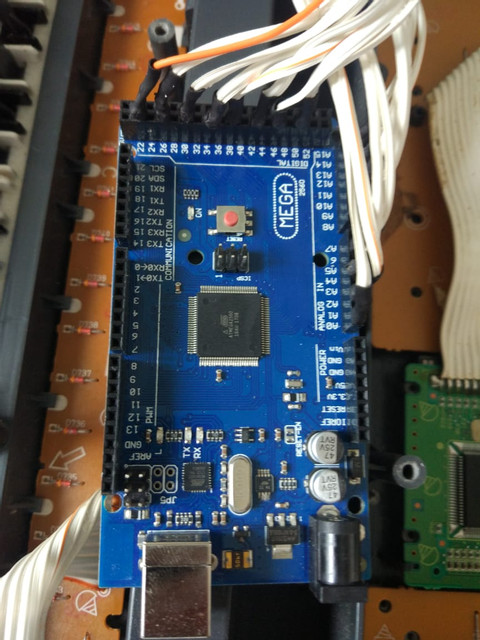

# CTK485_Arduino_Mega

Olá pessoal, após algumas buscas encontrei a solução para ligar meu antigo CASIO CTK 485 ao Arduino Mega 2560.

Em uma busca por fóruns, youtube, google encontrei diversas soluções focadas ao Arduino Uno em conjunto com circuitos compostos por outros elementos como Cis, os quais eu não possuia.

Resolvi então buscar mais a fundo dentro do fórum do Arduino quando me deparei com o post de nosso amigo <a href="https://forum.arduino.cc/index.php?action=profile">Oday_Alasali</a>, que com a ajuda do nosso amigo <a href="https://forum.arduino.cc/index.php?action=profile">Grumpy_Mike</a> conseguiu fazer o teclado CASIO de 49 teclas funcionar.

O primeiro passo que precisei fazer foi: desmontar, remover a solda do cabo flat que sai das teclas do meu teclado e ia para a placa mãe dele.

 

Após isso, foi necessário mapear as teclas, as quais eu acreditava estarem mapeadas pelo manual de serviço do meu CASIO. Triste engano, a configuração das teclas estavam todas erradas, então, precisei pegar o multímetro na escala de diodos e testar cada tecla para descobrir qual combinação de fios correspondia as teclas acionadas.

Utilizei uma planilha para me auxiliar na organização, ela está disponível <a href="doc/key_map.xlsx">aqui</a>.

Para quem não sabe, é a combinação de fios que gera o contato das teclas e corresponde as notas. No meu caso, consegui uma matriz da seguinte forma:

Depois de encontrar cada combinação foi necessário encontrar qual nota correspondia a cada tecla, para por fim encontrar o número MIDI correspondente a cada nota. Essa parte é muito importante para nosso programa.

Com essas informações em mãos segui para o código do programa fornecido pelos nossos colegas mencionados acima.

A primeira coisa que alterei foram as seguintes linhas, informando o número de colunas e linhas da minha matriz.

~~~
    const byte ROWS = 8; // 8 Linhas
    const byte COLS = 8; // 8 Colunas
~~~

Após isso, fiz a modificação na matriz em si, informando os números MIDI correspondentes a cada tecla mapeada acima.

~~~
char keys[COLS][ROWS] = {
  {36, 37, 38, 39, 40, 41, 42, 43},
  {44, 45, 46, 47, 48, 49, 50, 51},
  {52, 53, 54, 55, 56, 57, 58, 59},
  {60, 61, 62, 63, 64, 65, 66, 67},
  {68, 69, 70, 71, 72, 73, 74, 75},
  {76, 77, 78, 79, 80, 81, 82, 83},
  {84, 85, 86, 87, 88, 89, 90, 91},
  {92, 93, 94, 95, 96, 97, 98, 99}
};
~~~

Por fim, configurei quais saídas utilizaria no meu Arduino Mega 2560.

~~~
byte rowPins[ROWS] = {22, 26, 30, 34, 38, 42, 46, 50}; //connect to the row pinouts of the kpd
byte colPins[COLS] = {A0, A2, A4, A6, A8, A10, A12, A14}; //connect to the column pinouts of the kpd
~~~

Devido ao espaço para encaixe dos pinos optei em usar saídas alternadas, mas isso é questão de gosto.

Após isso, utilizando o software do Arduino coloquei o programa para dentro da placa.

Utilizei o Hairless para converter o sinal enviado pelo USB para um sinal MIDI e o LoopBe1 para simular uma porta MIDI nesta etapa já possuímos som.
