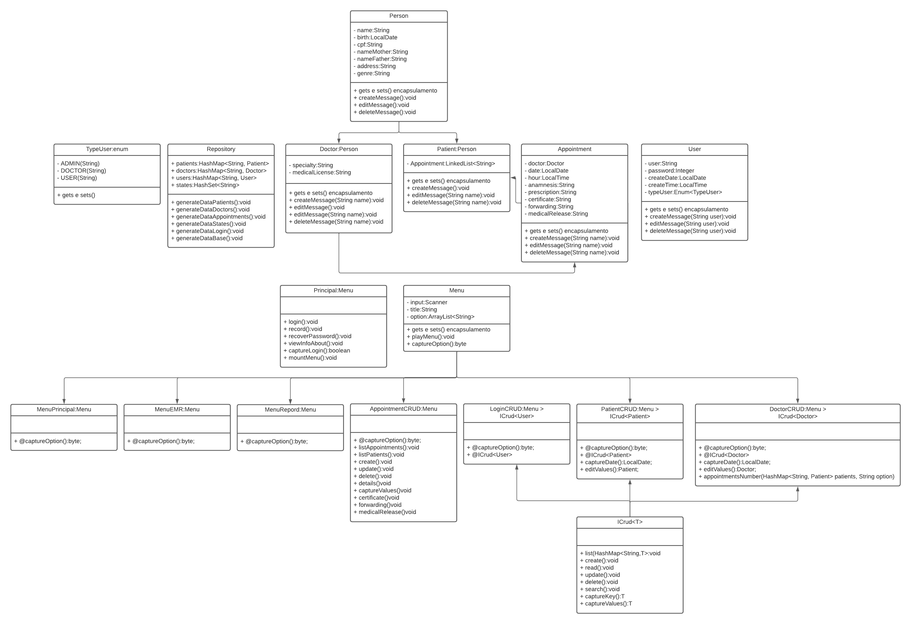

## Project EMR - Electronic Medical Record

## 🗃️&nbsp; Table of Contents

* [About the project](#about-project)
* [Class diagram](#class-diagram)
* [Application flowchart](#application-flowchart)
* [Application in operation](#application-operation)
* [Instructions for execute the Project](#execute-project)
* [Technologies and Concepts](#technologies)  
* [Author](#author)

 

---

## 🏥&nbsp; About the project 

It is a system used to manage the attendance of a clinic. It has functionalities to manage patients with their respective medical records, which in turn store their medical consultation.

 

---

## 📈&nbsp;Class Diagram 
 

 

----
## 🔀&nbsp; Application flowchart 

The system flow is based on the concept:
- Patient ➡️ Medical Record ➡️ medical consultation 

    
<b>👈🏽 &nbsp; Click here to expand the flowchart </b>

 

----

## ▶️&nbsp; Application in operation 

### Functionality view, click on play in the table to view the pages individually
  | Functionality  | View Here |
  |------|---------|
  |🏥&nbsp; Initial|[
▶️
](./readmes/main.md)|
  |🩺&nbsp; Appointment CRUD|[
▶️
](./readmes/appointment.md)
  |😷&nbsp; Patient CRUD|[
▶️
](./readmes/patient.md)
  |👨🏻‍💻&nbsp; User CRUD|[
▶️
](./readmes/user.md)
  |👩‍🔬&nbsp; Doctor CRUD|[
▶️
](./readmes/doctor.md)
  |📊&nbsp; Reports|[
▶️
](./readmes/reports.md)

### The back-end version of the project developed in JAVA can be found [HERE](https://github.com/seiler-emerson/Entra21_Project_EMR_2022).
   

## 👨🏽‍🏫&nbsp; Instructions for execute the Project 

1. Make a project copy to your machine:
    - git clone https://github.com/seiler-emerson/Entra21_Project_EMR_Front_End_2022.git
    - Or a direct download from the page [HERE](https://github.com/seiler-emerson/Entra21_Project_EMR_Front_End_2022.git).
    - Import the project into your VSCode and open with live server plugin.
        - If you don't have VSCode installed, watch this video I recorded teaching you how to install it. [VIEW VIDEO](https://youtu.be/82GnguThEAQ).

 

---

## 📚&nbsp; Technologies and Concepts 

In this project we use HTML5, CSS3, Bootstrap and apply the following concepts:

1. Git
    - Repository
    - Documentation
    - README.md
2. HTML/CSS
    - Setting up environment
    - Connecting pages
    - Media,
    - Semantics selectors
    - Grid layout
    - Bootstrap
    - Navigation
    - Forms

 

---

## 👨🏻‍🎓&nbsp; Author 

 

<table>
<thead>
	<tr>
		<th>
            
        </th>
	</tr>
</thead>
<tbody>
	<tr>
		<td>
            
        </td>
	</tr>
</tbody>
</table>

 

---

