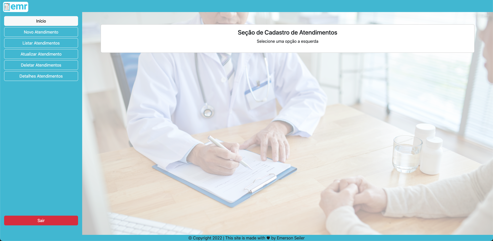
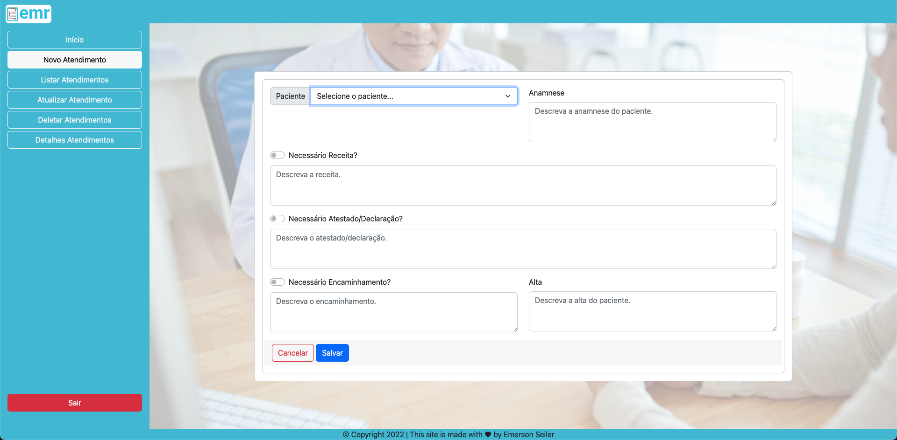
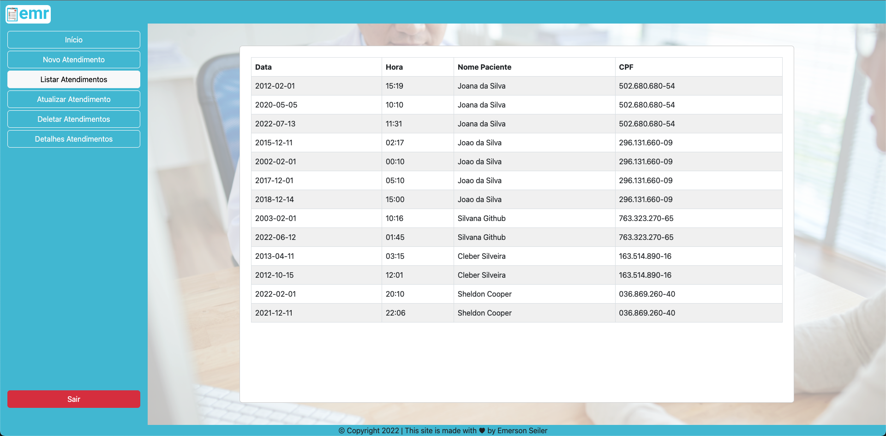
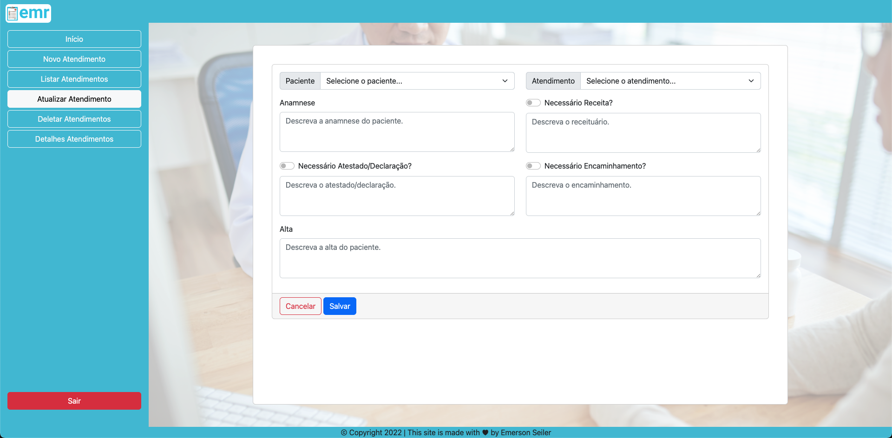
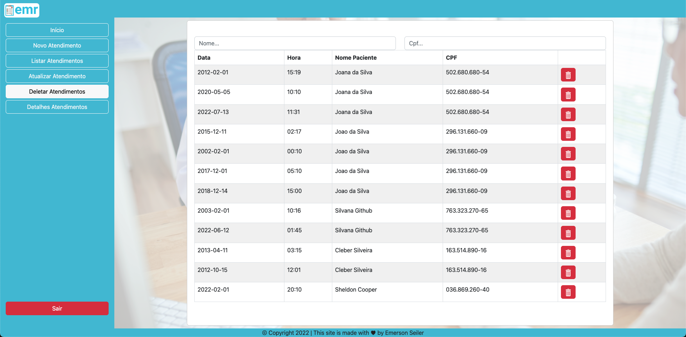
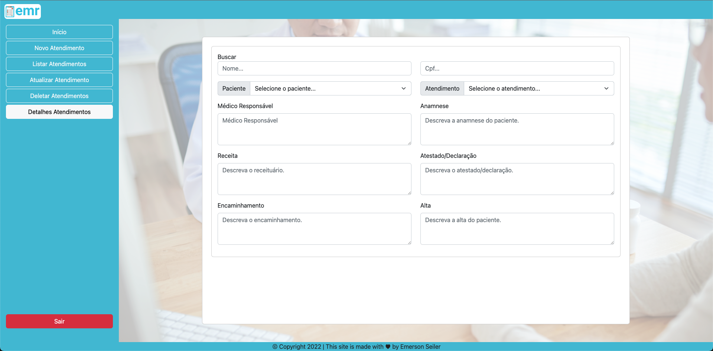

## Project EMR - Electronic Medical Record

## 🩺&nbsp; Crud Appointment

Here it is possible to create, list, edit, delete and detail appointments.

## Appointment

## Create Appointment

## List Appointments

## Update Appointment

## Delete Appointment

## Detail Appointment

