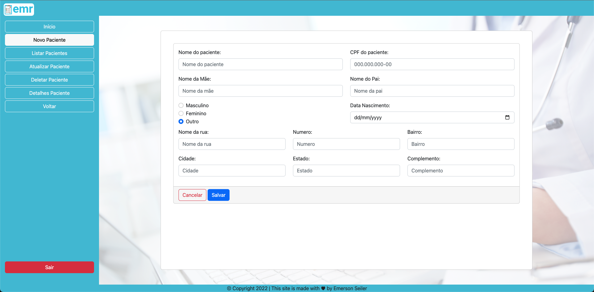
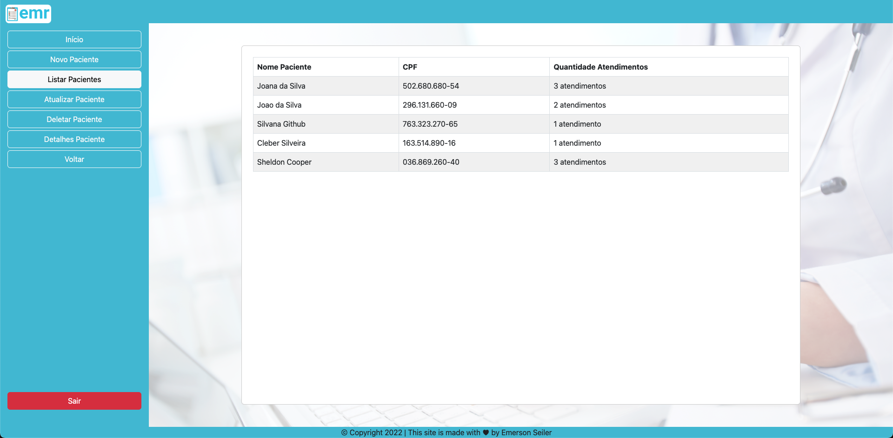
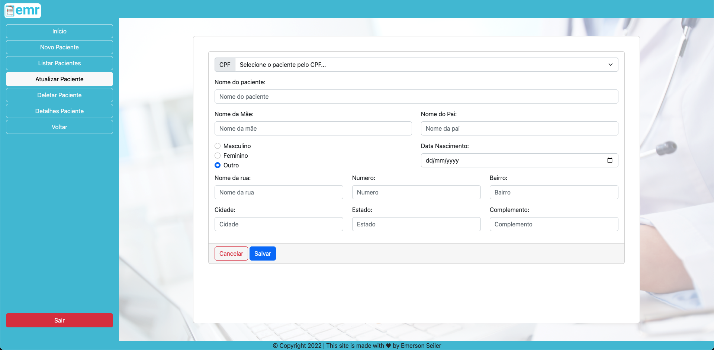
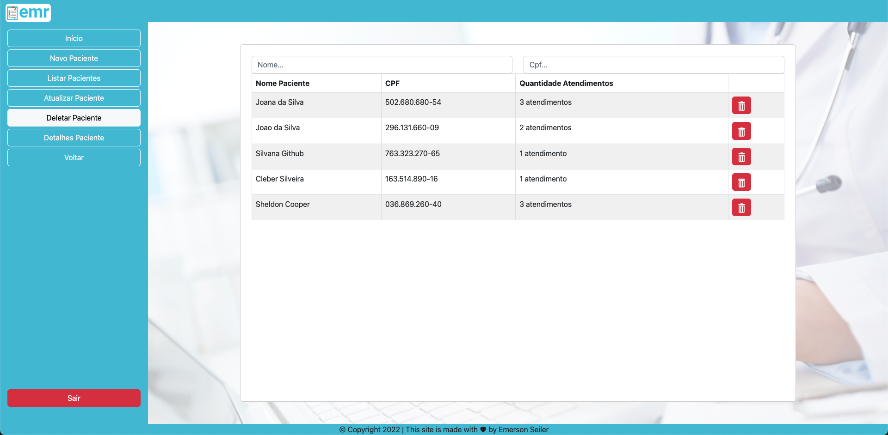
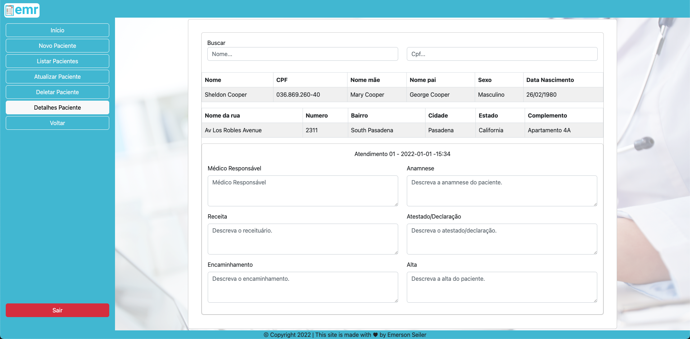

## Project EMR - Electronic Medical Record

## 😷&nbsp; Crud Patients

Here it is possible to create, list, edit, delete and detail patients.

## Patient

## Create Patient

## List Patients

## Update Patient

## Delete Patient

## Detail Patient

