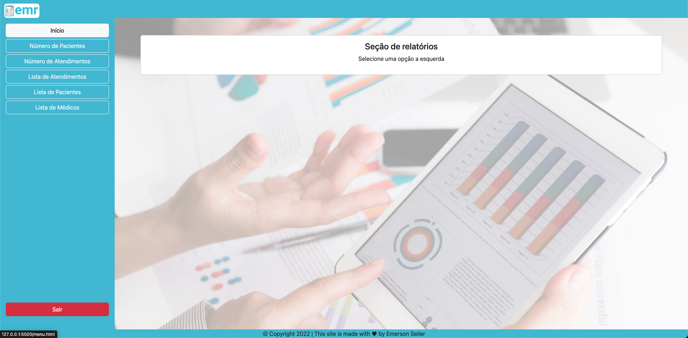
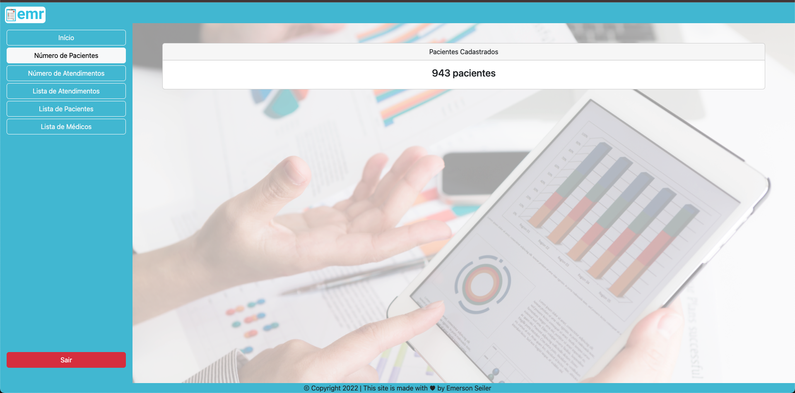
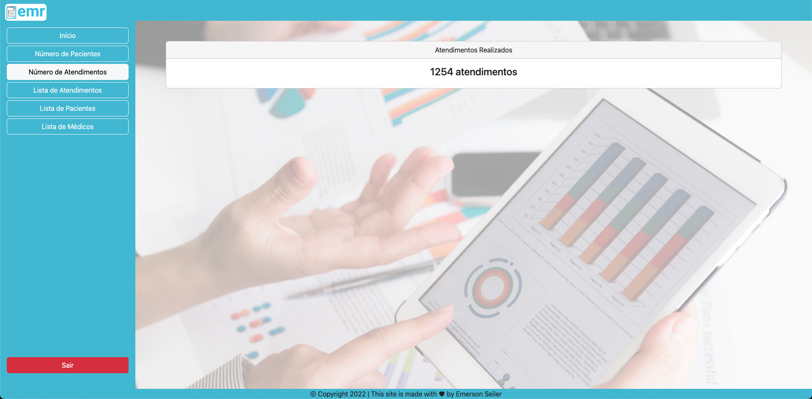
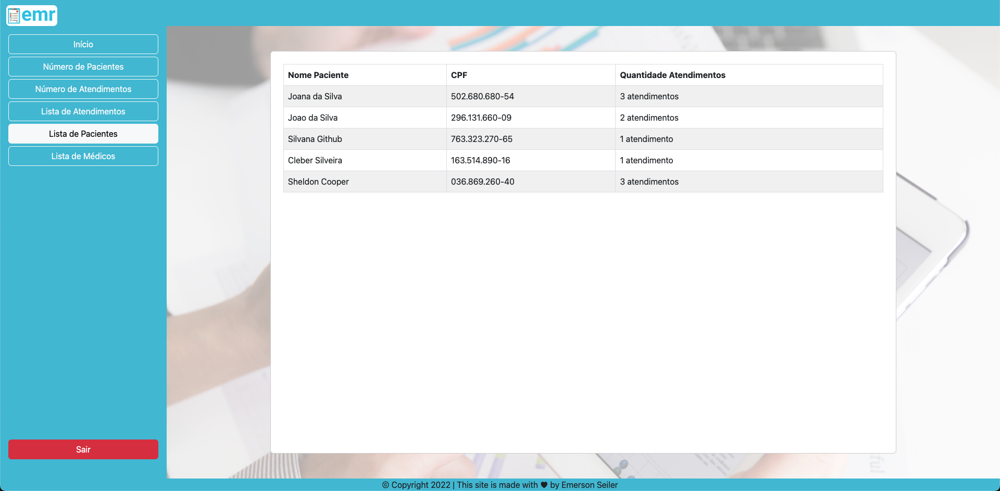
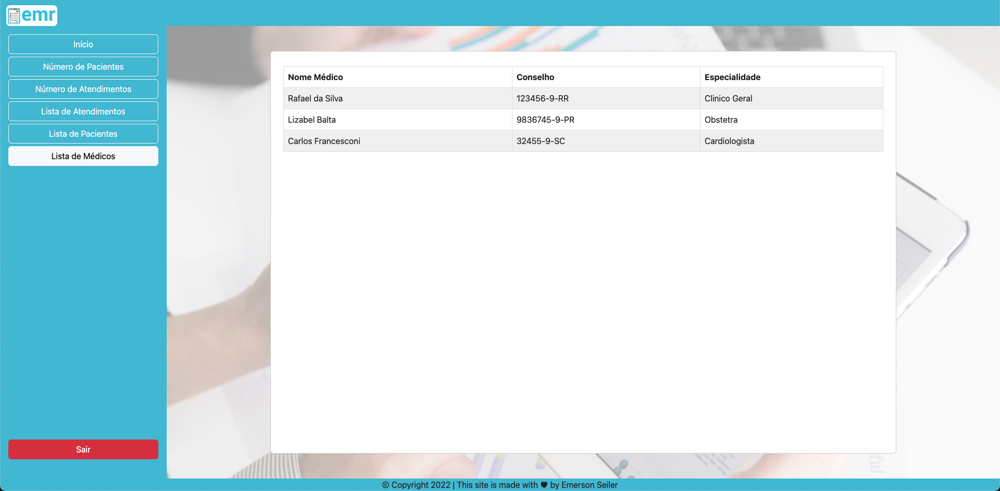
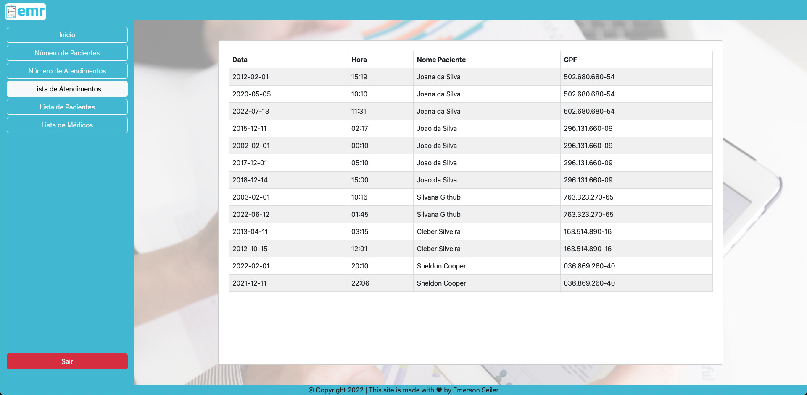

## Project EMR - Electronic Medical Record

## 📊&nbsp; Reports

Here it is possible to Here you can extract system reports.

## Report

## Report Number Patients

## Report Number Appointments

## Report List Patients

## Report List Doctors

## Report List Appointments

