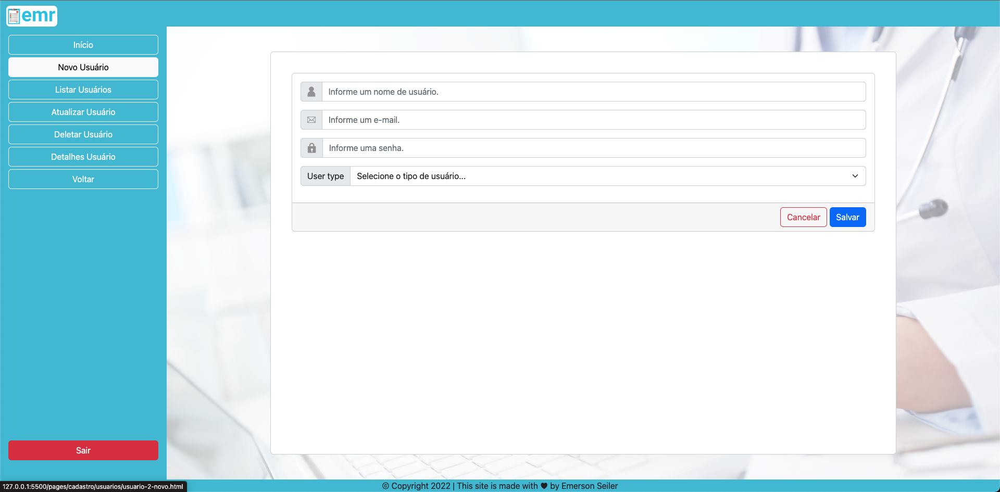
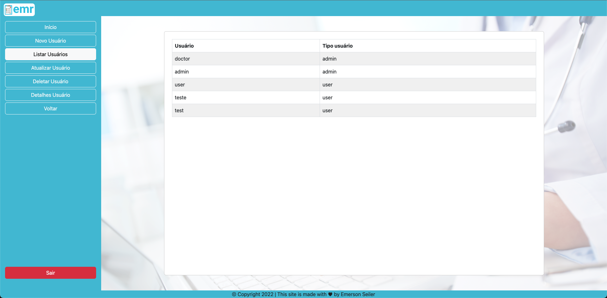
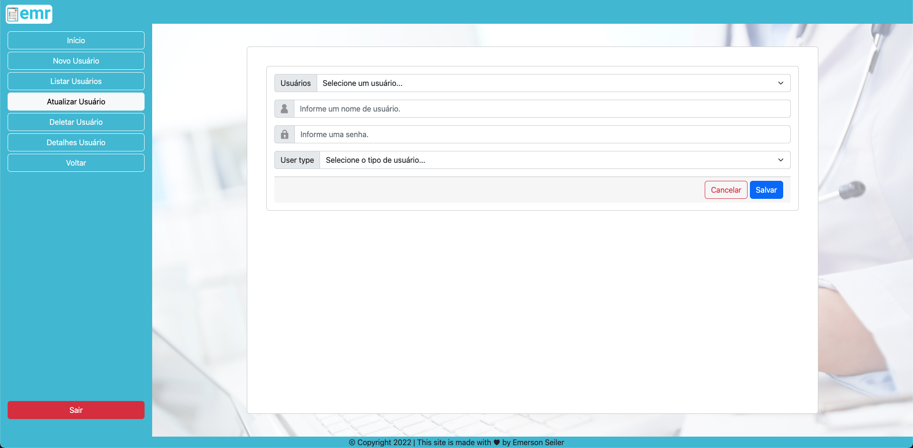
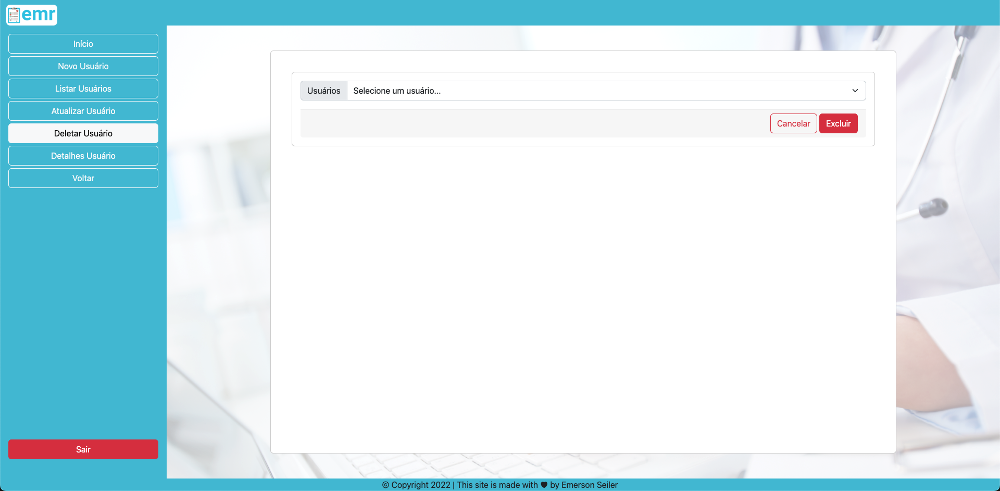
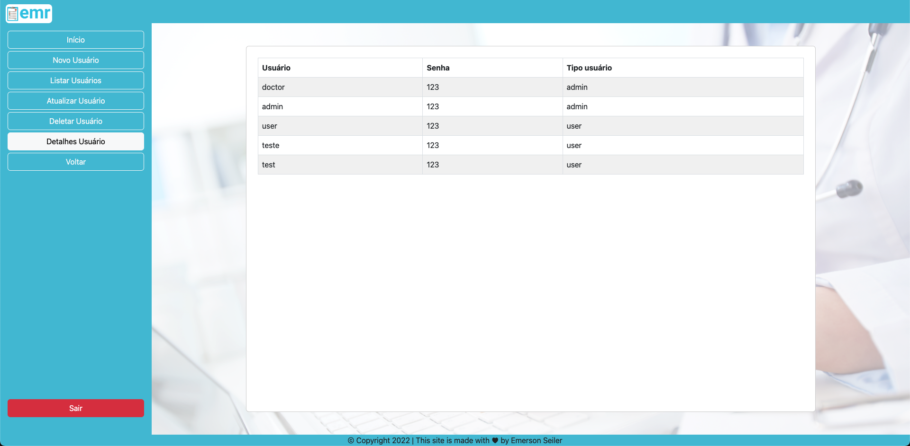

## Project EMR - Electronic Medical Record

## 👨🏻‍💻&nbsp; Crud Users

Here you can create, list, edit, delete and drill down to users.

## User

## Create User

## List Users

## Update User

## Delete User

## Detail User

