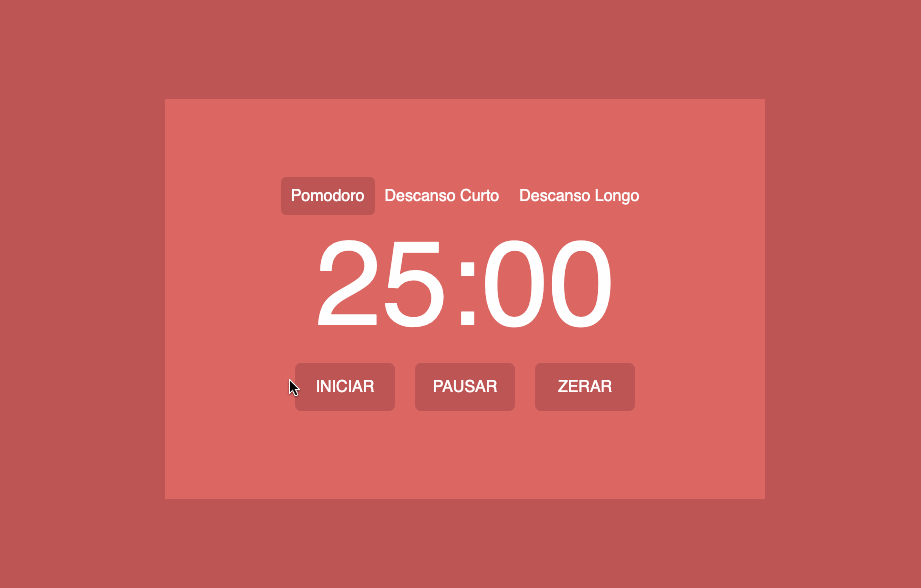

# SEILER POMODORO

Esté é um projeto de um contador pomodoro, que tem o objetivo de auxiliar a gestão do tempo para momentos de foco, dividindo os momentos de concentração em blocos de 25 minutos de atenção com pausas de 5 ou 15 minutos. 
Contém as seguintes funcionalidades:

<ul>
    <li>Timer de 25 minutos</li>
    <li>Timer de 15 minutos</li>
    <li>Timer de 05 minutos</li>
    <li>Alarme sonoro ao fim do timer</li>
    <li>Botão de início</li>
    <li>Botão de pausa</li>
    <li>Botão de reset</li>
    <li>Reset automático ao mudar entre pomodoro e os descansos</li>
</ul>

Entre em contato por <a href="https://www.linkedin.com/in/seileremerson/" target="_blank">aqui</a>!

 