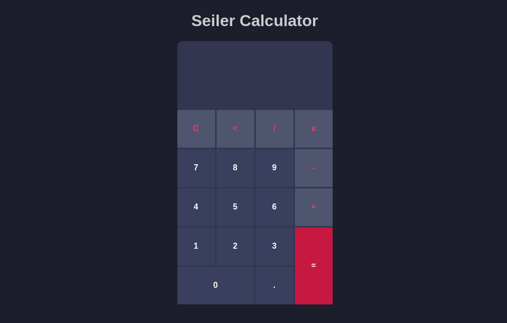

# SEILER CALCULADORA

Esté é um projeto de uma calculadora, onde é possível realizar as quatro operações básica:

<ul>
    <li>ADIÇÃO</li>
    <li>SUBTRAÇÃO</li>
    <li>MULTIPLICAÇÃO</li>
    <li>DIVISÃO</li>
</ul>

<h3>TESTE <a href="https://seileremerson.github.io/calculadora/" target="_blank">AQUI</a></h3>

Entre em contato por <a href="https://www.linkedin.com/in/seileremerson/" target="_blank">aqui</a>!

