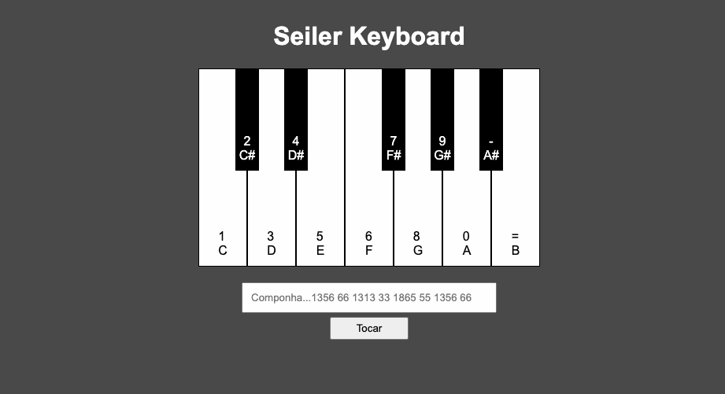

# SEILER PIANO KEYBOARD

Esté é um projeto de um simulador de piano, contendo uma oitava. 
Nele é possível ter a experiência de tocar um piano através do uso do teclado do seu computador. 
Utilizando as teclas de "1" até "=" você faz música!  
Experimente na composição a seguinte melodia: 1356 66 1313 33 1865 55 1356 66   
Contém as seguintes funcionalidades:

<ul>
    <li>Tocar as respectivas notas usando o teclado</li>
    <li>Composição, digitando as teclas correspondentes as notas.</li>
</ul>

As letas nas teclas representam as notas musicais, os números e sinais representam as teclas correspondentes no teclado

Entre em contato por <a href="https://www.linkedin.com/in/seileremerson/" target="_blank">aqui</a>!

 