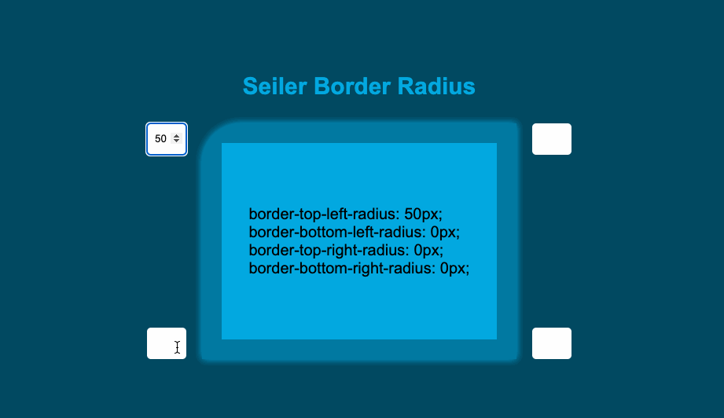

# SEILER BORDER RADIUS GENERATOR

Esté é um projeto de um gerador de border radius, onde é possível realizar a simulação do arredondamento das quatro bordas de forma individual.  
Possui as seguintes funcionalidades:

<ul>
    <li>Simulação lado direito superior</li>
    <li>Simulação lado direito inferior</li>
    <li>Simulação lado esquerdo superior</li>
    <li>Simulação lado esquerdo inferior</li>
    <li>Geração do código CSS para replicação</li>
</ul>

<h3>TESTE <a href="https://seiler-emerson.github.io/border_radius_generator/" target="_blank">AQUI</a></h3>

Entre em contato por <a href="https://www.linkedin.com/in/seileremerson/" target="_blank">aqui</a>!

