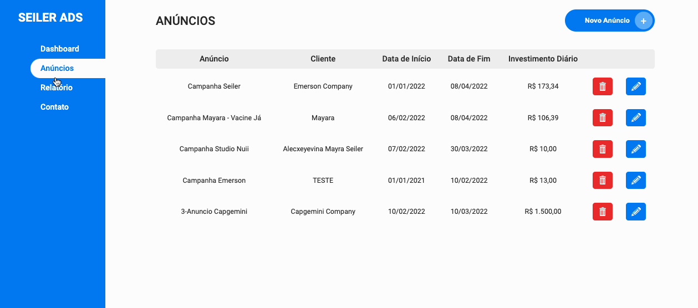
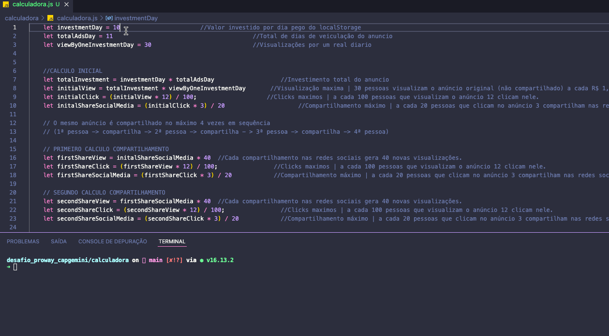

<h1 align="center">
    <a href="https://capgemini.proway.com.br/" alt="Desafio Academia Capgemini"> Desafio Academia Capgemini  </a>
</h1>

<h3 align="center">
    Desafio de Programação Academia Capgemini / Proway - 2021
</h3>
 

 

📜 Tabela de conteúdos
=================

   * [Sobre o desafio](#sobre-o-projeto)
   * [Desafio](#-desafio)
   * [Como executar o projeto](#-como-executar-o-projeto)
   * [Tecnologias](#-tecnologias)
   * [Autor](#-autor)

 

---

## 💻 Sobre o desafio

 Desafio desenvolvido para o processo de seleção da  [Academia Capgemini](http://capgemini.proway.com.br/). 🏆

 

---

## ⚙️ Desafio

A agência Divulga Tudo precisa de um programa para gerenciar os seus anúncios online.
O objetivo dos anúncios faz parte de uma campanha nas redes sociais.

O sistema de gerenciamento permitirá a gestão do anúncio e o rastreio dos resultados da campanha.
Este programa será composto de duas partes:

 

----

### 1ª Parte – Uma calculadora de alcance de anúncio online
 
Considere os seguintes critérios fictícios para desenvolver a calculadora de alcance de anúncio:

Baseados em dados de análise de anúncios anteriores, a agência tem os seguintes dados: 
  - A cada 100 pessoas que visualizam o anúncio 12 clicam nele.
  - A cada 20 pessoas que clicam no anúncio 3 compartilham nas redes sociais.
  - Cada compartilhamento nas redes sociais gera 40 novas visualizações.
  - 30 pessoas visualizam o anúncio original (não compartilhado) a cada R$ 1,00 investido.
  - O mesmo anúncio é compartilhado no máximo 4 vezes em sequência.
  - (1ª pessoa -> compartilha -> 2ª pessoa -> compartilha - > 3ª pessoa -> compartilha -> 4ª pessoa)

Crie um script em sua linguagem de programação preferida que receba o valor investido em reais e retorne uma projeção aproximada da quantidade máxima de pessoas que visualizarão o mesmo anúncio (considerando o anúncio original + os compartilhamentos).

 

----
### 2ª Parte - Sistema de cadastro de anúncios online

Considere os seguintes critérios fictícios para desenvolver o cadastro de anúncios:
Crie um sistema que permita o cadastro de anúncios. O anúncio deverá conter os seguintes dados:
  - Nome do anúncio
  - Cliente
  - Data de início
  - Data de término
  - Investimento por dia

O sistema fornecerá os relatórios de cada anúncio contendo:
  - Valor total investido
  - Quantidade máxima de visualizações
  - Quantidade máxima de cliques
  - Quantidade máxima de compartilhamentos

 

  ---

# Instruções para rodar o Projeto

Faça uma cópia do projeto para sua máquina: git clone https://github.com/seiler-emerson/desafio_proway_capgemini_2021.git ou um download.
 

 

# Calculadora
  - Opção 1
    - Tenha instalado o navegador google chrome.
    - Abra o arquivo Index.html e o arquivo calculadora.js.
    - Abra o console do navegador.
    - Digite o valor do investimento diário na variável investmentDay na linha 01.
    - Digite o total de dias de veiculação do anúncio na variável totalAdsDay na linha 02.
    - As projeções serão retornadas no console do navegador.

  - Opção 2
    - Tenha instalado o node.
    - Abra o arquivo calculadora.js.
    - Abra o terminal na pasta da aplicação.
    - Digite o valor do investimento diário na variável investmentDay na linha 01.
    - Digite o total de dias de veiculação do anúncio na variável totalAdsDay na linha 02.
    - Execute no terminal o comando "node calculadora.js" as projeções serão retornadas no terminal.
  
 

---

 

# Sistema de Cadastro de Anúncios

Para resolução do desafio, desenvolvi um sistema em HTML, CSS e Javascript.

Para testar a aplicação basta ter acesso a um navegador com internet e acessar o link abaixo.

[TESTE AQUI](https://seiler-emerson.github.io/proway_capgemini_2021/)

Outra forma é executando o arquivo index.html da pasta após o download do arquivo completo.

O sistema possui 4 telas
  - Dashboard: Mostra a projeção total de todos os anúncios cadastrados no sistema.
  - Anúncios: Mostra os anúncios cadastrados, permite a inclusão, edição e exclusão de anúncios.
  - Relatório: Mostra todos os anúncios cadastrados e suas respectivas projeções.
  - Contato: Dados para contato.

 

---

## ⚒ Tecnologias

Neste projeto optei por utilizar as seguintes tecnologias:

-   **[Javascript](https://www.javascript.com/)**
-   **[Node](https://nodejs.org/en/)**
-   **[Git](https://git-scm.com/)**

 

---

## 👷 Autor

 

<a href="https://www.linkedin.com/in/seileremerson/">
 
  
 <b>Emerson Seiler</b></a> 
  

 

---

Feito com ❤️ por Emerson Seiler 👋 [Entre em contato!](https://www.linkedin.com/in/seileremerson/)
