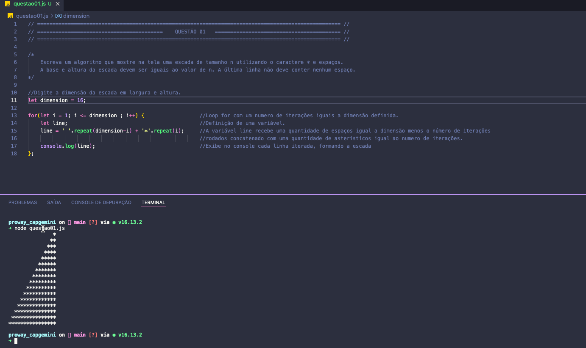
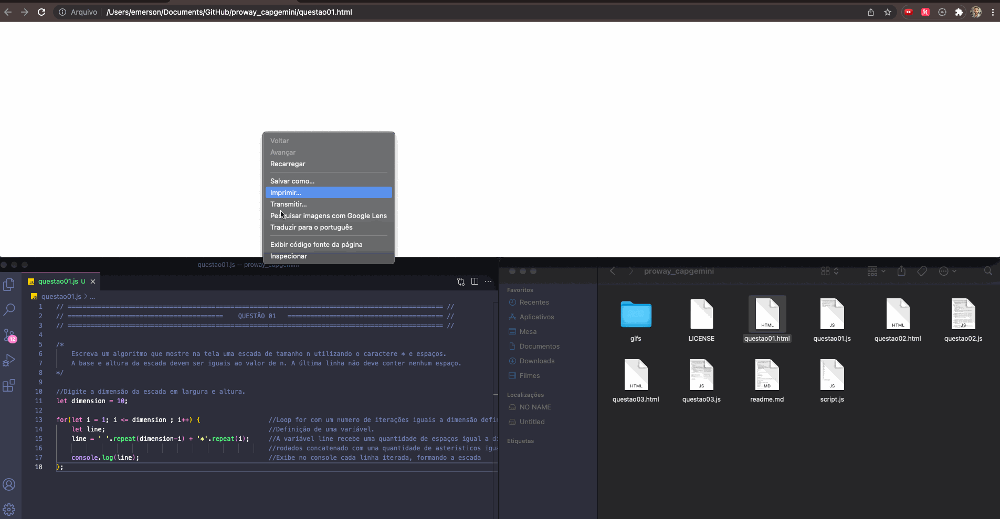
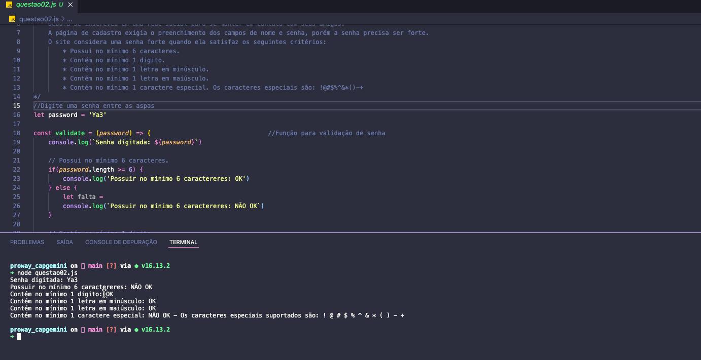
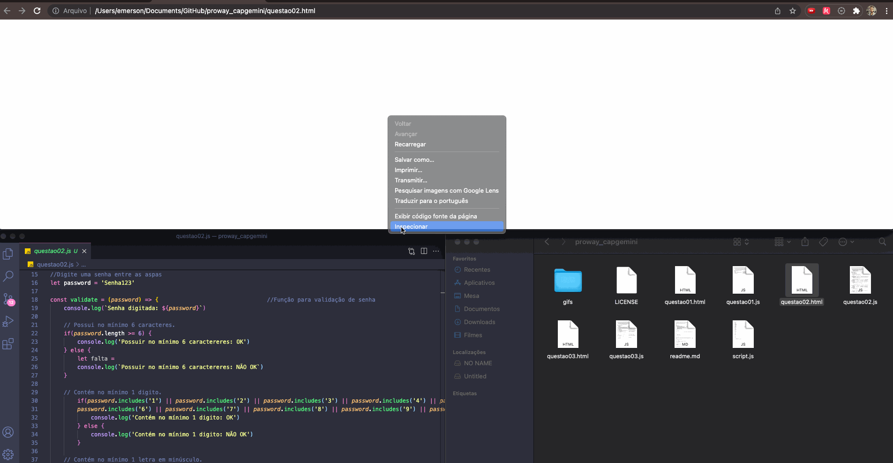
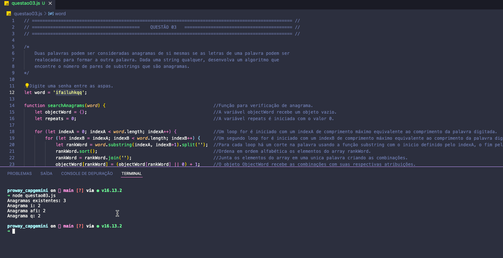
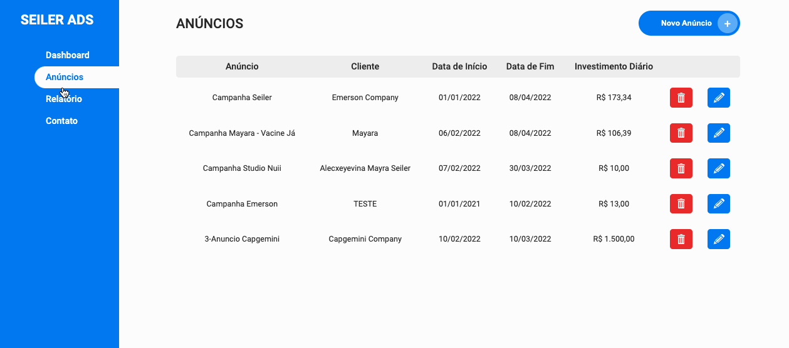

<h1 align="center">
    <a href="https://capgemini.proway.com.br/" alt="Desafio Academia Capgemini"> Desafio Academia Capgemini  </a>
</h1>

<h3 align="center">
    Desafio de Programação Academia Capgemini / Proway - 2022
</h3>
<br>


📜 Tabela de conteúdos
=================
<!--ts-->
   * [Sobre o desafio](#sobre-o-projeto)
   * [Desafio](#-desafio)
   * [Como executar o projeto](#-como-executar-o-projeto)
     * [Pré-requisitos](#user-content--pré-requisitos)
     * [Executando o projeto](#user-content--executando-o-projeto-via-node)
     * [Executando os testes](#user-content--executando-os-testes)
   * [Tecnologias](#-tecnologias)
   * [Autor](#-autor)
   * [Desafio 2021](https://github.com/seileremerson/proway_capgemini_2021)
<!--te-->

---

## 💻 Sobre o desafio

 Desafio desenvolvido para o processo de seleção da [Capgemini Brasil](http://capgemini.proway.com.br/). 🏆

<br>

---

## ⚙️ Desafio

- [x] Escada de tamanho "N"

- [x] Validador de senhas

- [x] Localizador de Anagramas:

<br>

---

##  Como executar o projeto

<br>

### 🚨 Pré-requisitos

<br>

Antes de começar, você vai precisar ter as seguintes ferramentas instaladas em sua máquina:
[Git](https://git-scm.com/downloads), [Node](https://nodejs.org/en/) ou o navegador [Chrome](https://www.google.com/chrome/)


### 🎮 Executando o projeto via Node

<br>

```bash
# Abra o terminal bash

# Clone este repositório
$ git clone https://github.com/seileremerson/proway_capgemini.git

# Acesse a pasta do projeto no terminal/cmd
$ cd proway_capgemini

# Execute este comando para rodar a aplicação 01
$ node questao01.js

# Execute este comando para rodar a aplicação 02
$ node questao02.js

# Execute este comando para rodar a aplicação 03
$ node questao03.js


```

<br>

### 🎮 Executando o projeto via Chrome

<br>

```bash
# Abra o terminal bash

# Clone este repositório
$ git clone https://github.com/seileremerson/proway_capgemini.git

# Acesse a pasta do projeto via gerenciador de arquivos

# Abra o navegador Google Chrome

# Abra o arquivo questao0X.html no navegador (Respectivo a cada questão)

# Clique com o botão direito do mouse e selecione a opção Inspecionar

# Abra a guia console


```

<br>

## 🤔 Executando os testes

<br>

### Com as aplicações rodando, digite o seguinte os valores nos respectivos campos:
#
- Questão 01 - dimension (linha 9)
    - Via Bash (Node)
    

    - Via Chrome (Console)
    
#
- Questão 02 - password (linha 16)
    - Via Bash (Node)
        

    - Via Chrome (Console)
    
#
- Questão 03 - word (linha 12)
    - Via Bash (Node)
    

    - Via Chrome (Console)
    

<br>

---

## ⚒ Tecnologias

Neste projeto optei por utilizar as seguintes tecnologias:


-   **[Javascript](https://www.javascript.com/)**
-   **[Node](https://nodejs.org/en/)**
-   **[Git](https://git-scm.com/)**

</br>

---
## ⚒ Desafio 2021

Eu também desenvolvi uma aplicação referente ao desafio proposto em 2021.

Você pode converir aqui: [Desafio 2021 - Gerenciador de Anuncios](https://github.com/seileremerson/proway_capgemini_2021)



</br>

---


## 👷 Autor

</br>

<a href="https://www.linkedin.com/in/seileremerson/">
 
 <br />
 <sub><b>Emerson Seiler</b></sub></a> <a href="https://www.linkedin.com/in/seileremerson/" title="Emerson Seiler"></a>
 <br />

[](https://www.linkedin.com/in/seileremerson/)

<br>

---


Feito com ❤️ por Emerson Seiler 👋 [Entre em contato!](https://www.linkedin.com/in/seileremerson/)
