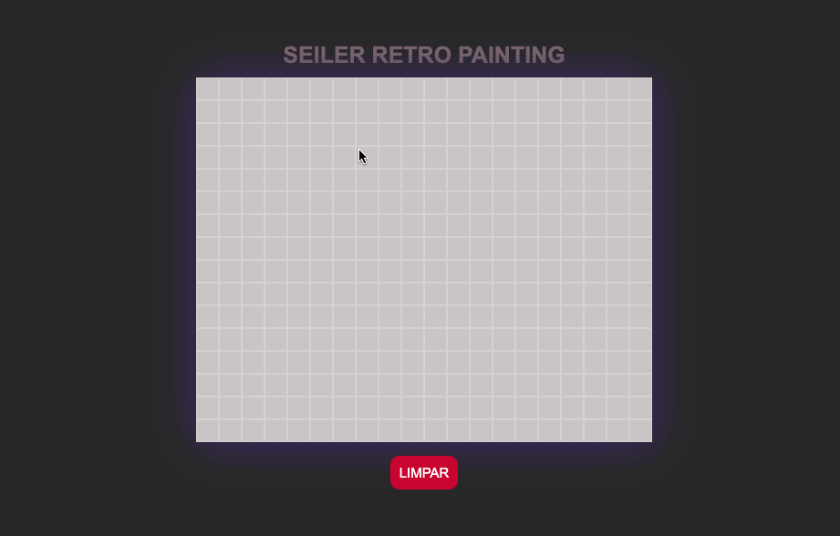

# SEILER RETRO PAINTING

Esté é um projeto de uma lousa retro, no estilo dos celulares antigos onde era possível desenhar colorindo os pixels.  
Contém as seguintes funcionalidades:

<ul>
    <li>Colorir os pixels</li>
    <li>Remover a cor individualmente</li>
    <li>Limpar todo o display</li>
</ul>

<h3>TESTE <a href="https://seiler-emerson.github.io/retro_painting/" target="_blank">AQUI</a></h3>

Entre em contato por <a href="https://www.linkedin.com/in/seileremerson/" target="_blank">aqui</a>!

 
